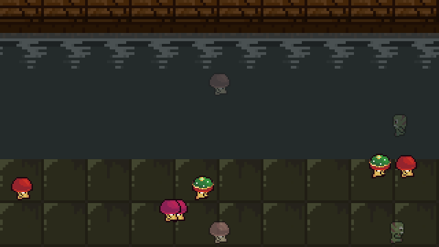

# Mushroom Dungeon & Chill

A pixel-art ambient scene for a Raspberry Pi hooked to a TV: fungus folk pacing a
sewer walkway while a canal flows past, lofi-girl style. Runs fullscreen at boot.



Native 320×180 canvas, GPU-upscaled with vsync — about 20% of one core on a Pi 3.

## Run on a Mac (dev)

```
python3 -m venv .venv && .venv/bin/pip install pygame-ce
.venv/bin/python lofi_claude/main.py --windowed        # Esc quits
.venv/bin/python play_music_on_mac.py                   # optional: dungeon music + drips
.venv/bin/python lofi_claude/test_scene_renders.py      # smoke check, prints ok
```

Flags for `main.py`: `--windowed`, `--silent` (no audio), `--cave` (the older cave scene).

## Deploy to a Pi

Raspberry Pi OS Bookworm with the desktop, `sudo apt install python3-pygame`,
key-based SSH set up (`ssh-copy-id`). Then:

```
cp deploy.env.example deploy.env   # set PI_HOST and PI_USER
./deploy.sh
```

That runs the local check, copies `lofi_claude/` to `~` on the Pi, installs
`lofi-claude.service`, and starts it. It starts on every boot from then on.
`sudo systemctl stop lofi-claude` to get the desktop back.

## Layout

```
lofi_claude/
├── main.py                  # window, loop, layer selection
├── scene_sewer_canal.py     # wall, flowing water, walkway (default scene)
├── sprite_big_walker.py     # the walkers and their lanes
├── sprite_fungus_walkers.py # frame math shared by walkers
├── scene_cave_tilemap.py    # older --cave scene
├── tileset_loader.py        # tile/character sheet access
├── music_dungeon_playback.py
├── test_scene_renders.py
├── lofi-claude.service
└── assets/                  # LimeZu tiles + CC0 audio, see CREDITS.md
```

Art by LimeZu (CC BY 4.0), music by TAD (CC0) — full credits in [CREDITS.md](CREDITS.md).
